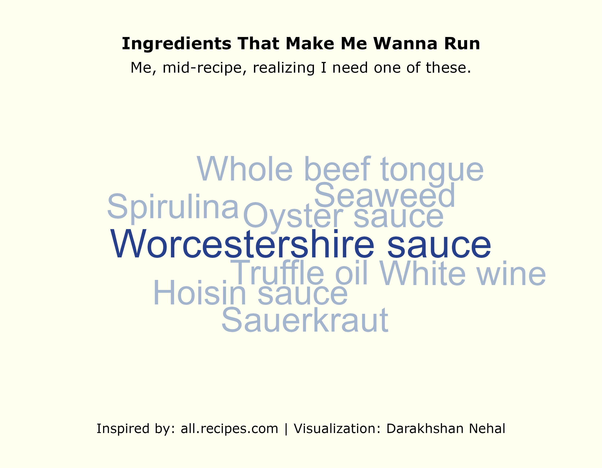

# Worceste–WHAT!?

Inspired by the **allrecipes.com** dataset from [TidyTuesday (2025-09-16)](https://github.com/rfordatascience/tidytuesday/blob/main/data/2025/2025-09-16/readme.md), I used **`ggwordcloud`** to create visualization summarizing ingredients that aren’t exactly quick-recipe friendly, at least for me.

