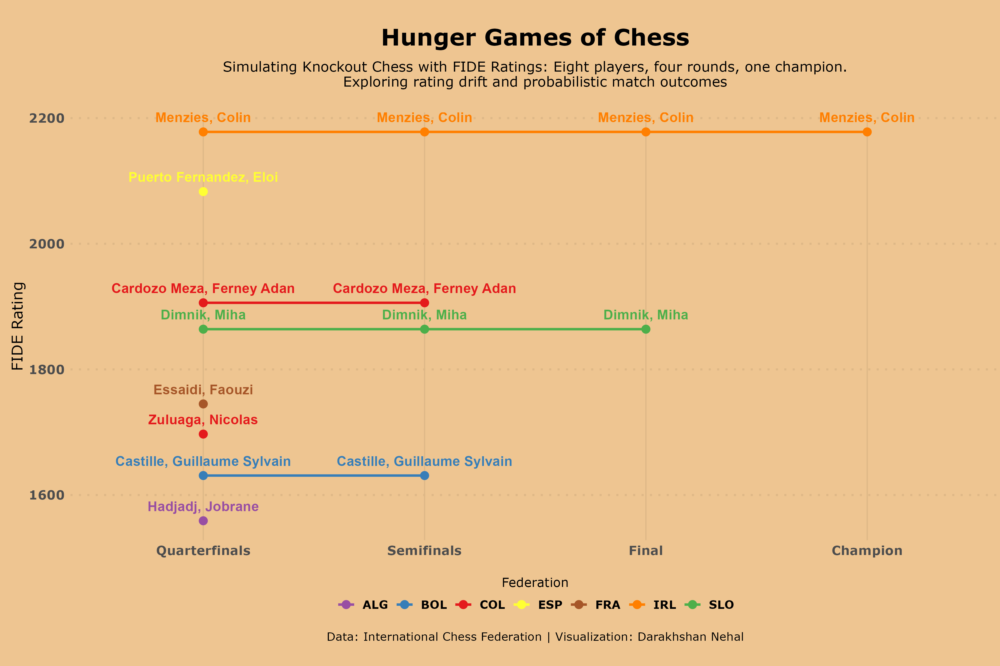

## Simulating Knockout Chess with FIDE Ratings

This week, I simulated a knockout-style chess tournament using FIDE rating data from August and September 2025. Eight players were randomly selected and matched across four rounds, quarterfinals to champion, using Elo-based win probabilities.

The final plot visualizes each player's rating progression across rounds.

**Data**: International Chess Federation \| [#TidyTuesday (2025-09-23)](https://github.com/rfordatascience/tidytuesday/blob/main/data/2025/2025-09-23/readme.md)
