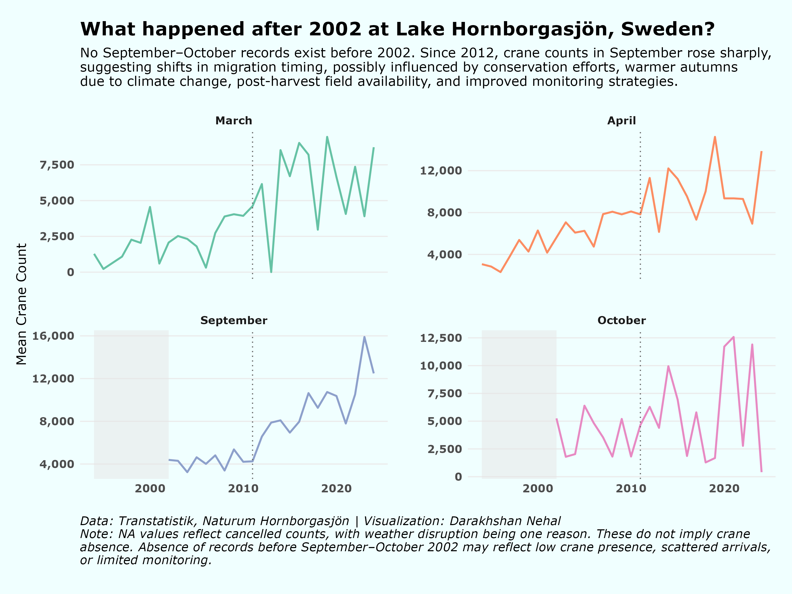

## Cranes at Lake Hornborgasjön, Sweden (1994–2024)

This visualization highlights ecological shifts in September–October arrivals post-2002, possibly influenced by climate change, conservation efforts, and improved monitoring.

    

### R Packages Used

| Package          | Purpose                                       |
|------------------|-----------------------------------------------|
| **tidyverse**    | Core data wrangling and visualization         |
| **lubridate**    | Date parsing and extraction (`year`, `month`) |
| **RColorBrewer** | Color palettes for categorical aesthetics     |
| **skimr**        | Data summary                                  |
| **scales**       | Axis formatting (comma labels for counts)     |

**Data**: Transtatistik, Naturum Hornborgasjön\| [#TidyTuesday (2025-09-30)](https://github.com/rfordatascience/tidytuesday/blob/main/data/2025/2025-09-30/readme.md)
